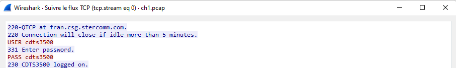
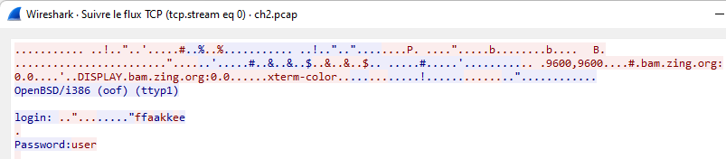
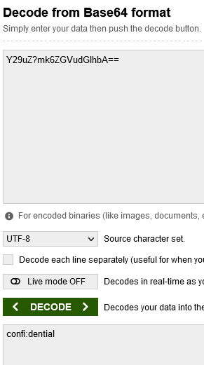
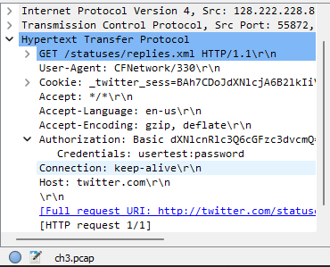
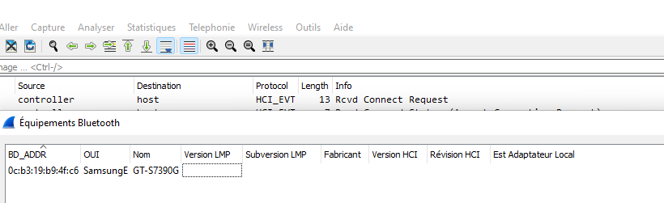
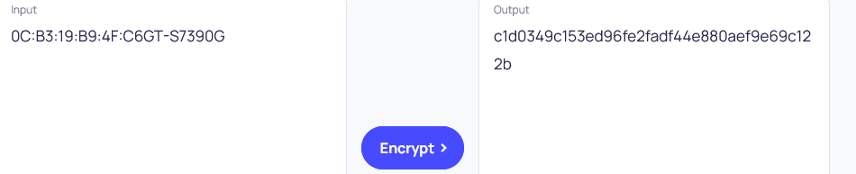
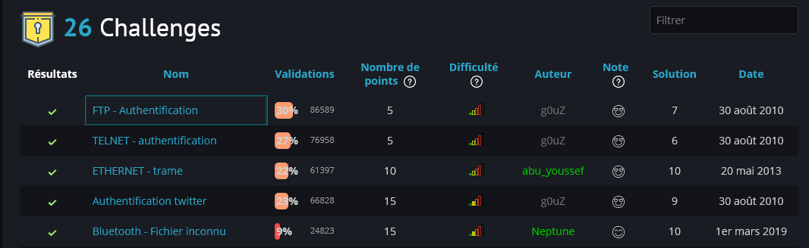

# Challenge Network Root me 

## The challenge 

## 1 : FTP - Authentification
>###  Enoncé
-------------------
 Un échange authentifié de fichier réalisé grâce au protocole FTP. Retrouvez le mot de passe utilisé par l’utilisateur.
#
>### Solution

- 1. Ouvrir le lien sur le bouton démarer sur un autre onglet
- 2. Ouvrir le fichier télecharger 'ch1.pcap' 
- 3. Recherche ftp dans la barre de recherche wireshark
- 4. Suivre le TCP

 

 ## 2 : TELNET - Authentification
>###  Enoncé
Retrouvez le mot de passe de l’utilisateur dans cette capture réseau de session TELNET.
-------------------
 
#
>### Solution

- 1. Ouvrir le lien sur le bouton démarer sur un autre onglet
- 2. Ouvrir le fichier télecharger 'ch2.pcap' 
- 3. Recherche telnet dans la barre de recherche wireshark
- 4. Suivre le TCP

## 3 : ETHERNET - trame
>###  Enoncé
Retrouvez les données normalement confidentielles contenues dans cette trame.
-------------------
 
#
>### Solution

- 1. Ouvrir le lien sur le bouton démarer sur un autre onglet
- 2. 00 05 73 a0 00 00 e0 69 95 d8 5a 13 86 dd 60 00
00 00 00 9b 06 40 26 07 53 00 00 60 2a bc 00 00
00 00 ba de c0 de 20 01 41 d0 00 02 42 33 00 00
00 00 00 00 00 04 96 74 00 50 bc ea 7d b8 00 c1
d7 03 80 18 00 e1 cf a0 00 00 01 01 08 0a 09 3e
69 b9 17 a1 7e d3 47 45 54 20 2f 20 48 54 54 50
2f 31 2e 31 0d 0a 41 75 74 68 6f 72 69 7a 61 74
69 6f 6e 3a 20 42 61 73 69 63 20 59 32 39 75 5a
6d 6b 36 5a 47 56 75 64 47 6c 68 62 41 3d 3d 0d
0a 55 73 65 72 2d 41 67 65 6e 74 3a 20 49 6e 73
61 6e 65 42 72 6f 77 73 65 72 0d 0a 48 6f 73 74
3a 20 77 77 77 2e 6d 79 69 70 76 36 2e 6f 72 67
0d 0a 41 63 63 65 70 74 3a 20 2a 2f 2a 0d 0a 0d
0a 
- 3. Decode le fihier HEX en string
- 4. Y29uZ?mk6ZGVudGlhbA==
- 5. Decode la base64 => mot de passe : confi:dential
 

 
 ## 4 : Authentification twitter
>###  Enoncé
Une session d’authentification twitter a été capturée. Retrouvez le mot de passe de l’utilisateur dans cette capture réseau.
-------------------
 
#
>### Solution

- 1. Ouvrir le lien sur le bouton démarer sur un autre onglet
- 2. Ouvrir le fichier télecharger 'ch3.pcap' 
- 3. On regarde en bas de l'authorization

## 5 : Bluetooth - Fichier inconnu
>###  Enoncé
Votre ami travaillant à l’ANSSI a récupéré un fichier illisible dans l’ordi d’un hacker. Tout ce qu’il sait est que cela provient d’un échange entre un ordinateur et un téléphone. A vous d’en apprendre le plus possible sur ce téléphone.

La réponse est le hash SHA1 de la concaténation de l’adresse MAC (en majuscules) et du nom du téléphone.

-------------------
 
#
>### Solution

- 1. Ouvrir le lien sur le bouton démarer sur un autre onglet
- 2. Ouvrir le fichier télecharger 'ch18.bin' 
- 3. Illustration

- 4. En met en majuscules => 0C:B3:19:B9:4F:C6GT-S7390G
- 5. Decode le fichier SHA1 =>  c1d0349c153ed96fe2fadf44e880aef9e69c122b

# Challenge finie
> ### image de verification

 

## License

C

**MihajaFi!**